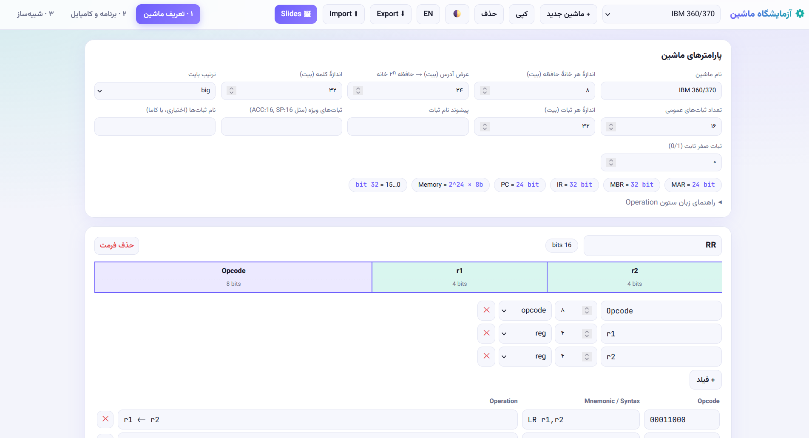
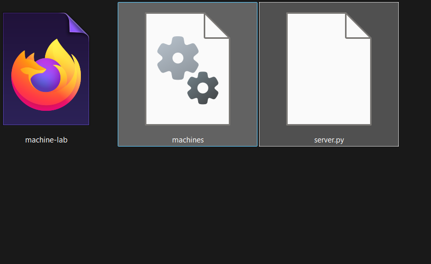
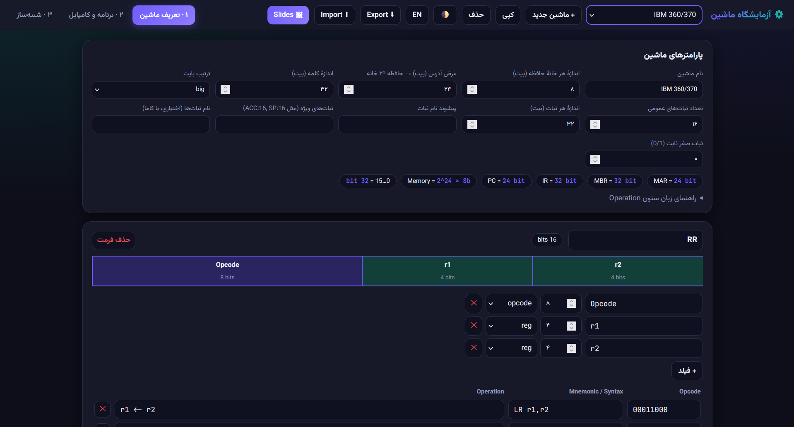
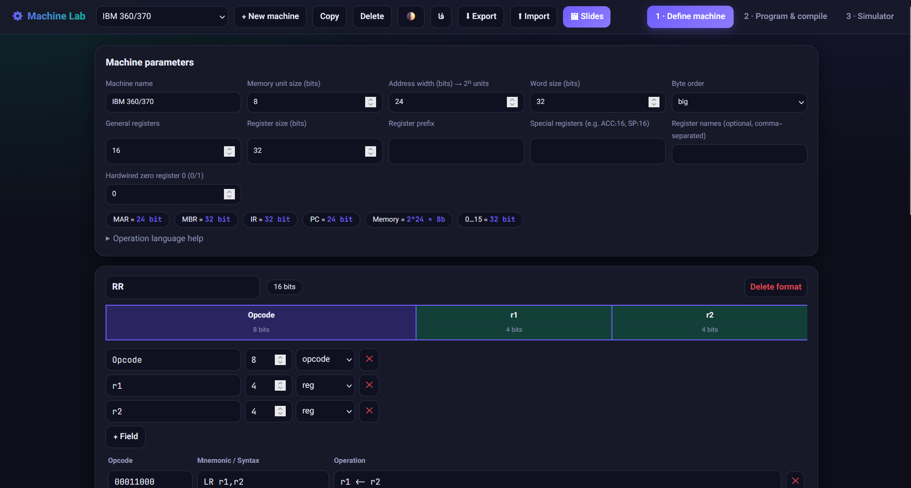
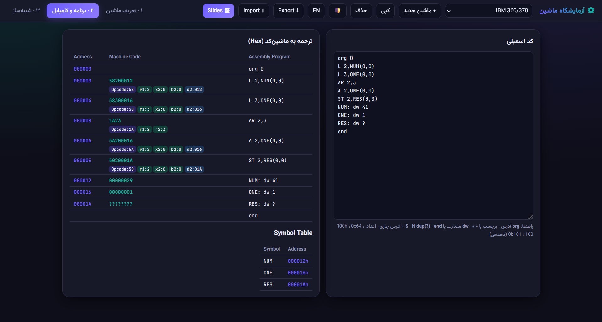
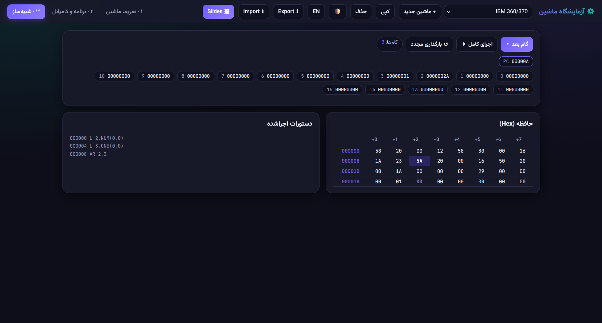
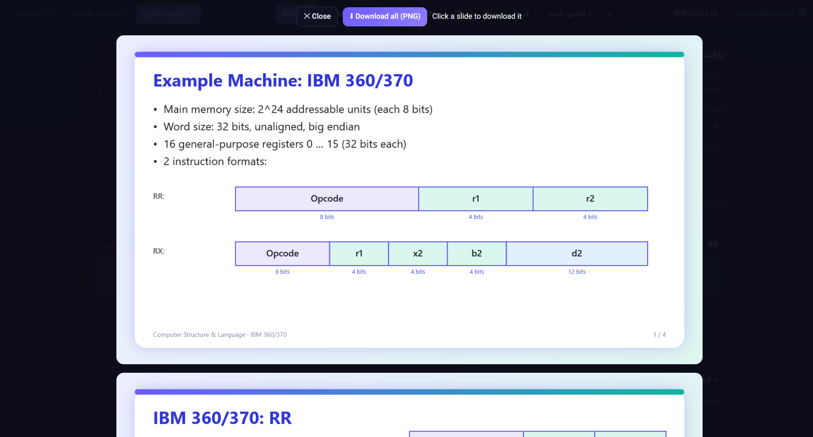
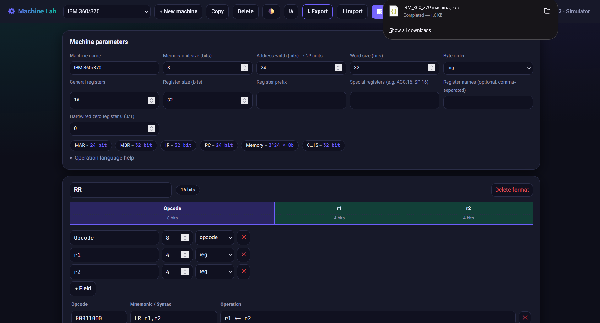

<div align="center">

# ⚙️ Machine Lab — آزمایشگاه ماشین

**طراحی ماشین دلخواه، نوشتن اسمبلی برایش و شبیه‌سازی اجرا — همه در یک فایل HTML**

[English](README.md) · **فارسی**


<picture>
  <source media="(prefers-color-scheme: dark)" srcset="pics/main-page-dark.png">
  <source media="(prefers-color-scheme: light)" srcset="pics/main-page-light.png">
  
</picture>

</div>

<div dir="rtl">

## فهرست

1. [معرفی](#معرفی)
2. [ویژگی‌ها و نسخه‌ها](#ویژگیها-و-نسخهها)
3. [نصب و اجرا](#نصب-و-اجرا)
4. [گشت‌وگذار در رابط کاربری](#گشتوگذار-در-رابط-کاربری)
5. [تعریف ماشین](#تعریف-ماشین)
6. [زبان Operation](#زبان-operation)
7. [زبان اسمبلی](#زبان-اسمبلی)
8. [شبیه‌ساز](#شبیهساز)
9. [خروجی اسلاید (PNG)](#خروجی-اسلاید-png)
10. [Export / Import](#export--import)
11. [ذخیره‌سازی در SQLite](#ذخیرهسازی-در-sqlite)
12. [ماشین‌های پیش‌فرض](#ماشینهای-پیشفرض)
13. [مثال گام‌به‌گام: یک ماشین تک‌آدرسه](#مثال-گامبهگام-یک-ماشین-تکآدرسه)
14. [معماری فنی](#معماری-فنی)
15. [محدودیت‌ها](#محدودیتها)
16. [رفع اشکال و پرسش‌های پرتکرار](#رفع-اشکال-و-پرسشهای-پرتکرار)
17. [Changelog](#changelog)
18. [مشارکت](#مشارکت)
19. [لایسنس](#لایسنس)

---

## معرفی

**Machine Lab** یک ابزار آموزشی برای درس «ساختار و زبان کامپیوتر» است. در این درس معمولاً یک ماشین فرضی (مثل *Example Machine 3/4/5/6*) معرفی می‌شود: اندازهٔ حافظه، اندازهٔ کلمه، ثبات‌ها، فرمت‌های دستور و جدول دستورات. بعد از آن باید روی کاغذ برنامهٔ اسمبلی نوشت و آن را به کد ماشین ترجمه کرد.

این برنامه همین کار را خودکار می‌کند:

- **ماشین را خودت تعریف می‌کنی:** پارامترها، هر تعداد فرمت دستور، و برای هر فرمت دستورات (Opcode، سینتکس و عملکرد).
- **ستون Operation قابل اجراست:** عملکرد هر دستور (مثل `M[addr1] <- M[addr1] + M[addr2]`) با یک زبان کوچک نوشته می‌شود که برنامه آن را parse و اجرا می‌کند.
- **به اسمبلی همان ماشین کد می‌زنی** و کنار برنامه، آدرس و کد ماشین هر خط را **به‌صورت Hexadecimal** می‌بینی؛ با همان قالبی که در جداول جزوه هست.
- **برنامه را قدم‌به‌قدم اجرا می‌کنی** و تغییر ثبات‌ها، حافظه و PC را می‌بینی.
- **اسلاید PNG به سبک جزوه می‌گیری**، ماشین را با JSON برون‌ریزی/درون‌ریزی می‌کنی، یا همه‌چیز را در یک فایل SQLite نگه می‌داری.

کل برنامه یک فایل `machine-lab.html` است؛ بدون وابستگی و بدون مرحلهٔ build (فقط فونت‌ها از Google Fonts می‌آیند و فونت جایگزین محلی هم دارند).

> **تطبیق با جزوه.** در Example Machine 3، خط اول برنامهٔ نمونه (`add sum,curr`) در آدرس `0000` به `030022001E` ترجمه می‌شود، دقیقاً مثل اسلایدهای درس. Machine 4 و 5 هم با اسلایدها می‌خوانند. همهٔ برنامه‌های نمونه هم بدون رابط گرافیکی اسمبل و اجرا شده‌اند تا نتیجه‌شان بررسی شود (بخش [ماشین‌های پیش‌فرض](#ماشینهای-پیشفرض)).

---

## ویژگی‌ها و نسخه‌ها

| ویژگی | توضیح | نسخه |
|---|---|:---:|
| تعریف ماشین دلخواه | خانهٔ حافظه، عرض آدرس، اندازهٔ کلمه، big/little endian، تعداد و اندازهٔ ثبات‌ها، پیشوند نام ثبات، ثبات‌های ویژه (مثل `ACC:16`) | 1.0.0 |
| فرمت‌های دستور نامحدود | هر فرمت فهرستی از فیلدهای نام‌دار با تعداد بیت و نوع (`opcode`، `reg`، `addr`، `imm`) است | 1.0.0 |
| جدول دستورات | ستون‌های Opcode، Mnemonic/Syntax و Operation با اعتبارسنجی لحظه‌ای | 1.0.0 |
| زبان Operation | parse و اجرا: انتساب، حافظه، شرط، عملگرهای ریاضی و منطقی | 1.0.0 |
| اسمبلر دو‌پاسه | برچسب، `org`، `dw`، `dup`، `?`، `end`، عبارت‌های ساده، Symbol Table | 1.0.0 |
| خروجی Hex | ستون‌های Address / Machine Code / Assembly Program با فیلدهای رنگی | 1.0.0 |
| نمودار فرمت دستور | جعبه‌های متناسب با تعداد بیت، مثل اسلایدهای جزوه | 1.0.0 |
| شبیه‌ساز | Step / Run / Reload، ثبات‌ها، حافظهٔ Hex، لاگ دستورات | 1.0.0 |
| مدیریت ماشین‌ها | ماشین جدید، کپی، حذف، جابه‌جایی؛ ذخیرهٔ خودکار در `localStorage` | 1.0.0 |
| ماشین‌های جزوه | Example Machine 3، 4 و 5 با برنامهٔ نمونه | 1.0.0 |
| تم روشن/تیره | پیروی از تنظیم سیستم و دکمهٔ دستی | 1.0.0 |
| **خروجی اسلاید PNG** | اسلاید انگلیسی: مشخصات ماشین، یک اسلاید برای هر فرمت با جدول دستورات، و اسلاید اندازهٔ ثبات‌ها با توضیح | **1.1.0** |
| **رابط دو‌زبانه** | سوییچ فارسی ⇄ انگلیسی | **1.1.0** |
| **ماشین‌های معروف** | IBM 360/370، Intel 8086/8088، RISC-V RV32I، هستهٔ GPU آموزشی | **1.1.0** |
| **Export / Import** | ذخیره و بازیابی هر ماشین (با برنامه‌اش) به‌صورت JSON | **1.1.0** |
| **دیتابیس SQLite** | `server.py` فایل `machines.db` را کنار برنامه می‌سازد و پیوسته به‌روز می‌کند | **1.1.0** |
| چند فیلد opcode در یک فرمت | برای معماری‌هایی مثل RISC-V و x86 (`funct3`/`funct7`، ModRM) | **1.1.0** |
| نام دلخواه ثبات‌ها | مثل `AX,CX,DX,BX,SP,BP,SI,DI` | **1.1.0** |
| ثبات صفر ثابت | برای معماری‌هایی مثل RISC-V (`x0 = 0`) | **1.1.0** |
| `sext(x,n)` در Operation | بسط علامت برای immediateها | **1.1.0** |
| `$` در اسمبلی | آدرس جاری برای پرش‌های نسبی | **1.1.0** |

---

## نصب و اجرا

### حالت ۱: فقط مرورگر

فایل `machine-lab.html` را در یک مرورگر مدرن باز کنید. داده‌ها در `localStorage` مرورگر نگه داشته می‌شوند.

> `localStorage` به مرورگر **و** آدرس صفحه وابسته است. باز کردن مستقیم فایل (`file://…`) و باز کردن آن از طریق `http://localhost:8000` دو حافظهٔ جدا می‌دهند. برای انتقال ماشین‌ها بین آن‌ها از [Export / Import](#export--import) استفاده کنید.

### حالت ۲: همراه با دیتابیس SQLite (از نسخهٔ 1.1.0)

پیش‌نیاز: Python 3 (فقط کتابخانهٔ استاندارد؛ چیزی نصب نمی‌کنید).

```bash
# machine-lab.html و server.py باید در یک پوشه باشند
python server.py        # در ویندوز می‌توانید از  py server.py  هم استفاده کنید
# سپس باز کنید:  http://localhost:8000
```

فایل `machines.db` کنار `server.py` ساخته می‌شود و بعد از هر تغییر خودکار به‌روز می‌شود. وقتی سرور در دسترس باشد، نشان **SQLite ✓** در نوار بالا دیده می‌شود.

<div align="center">



*هر سه فایل کنار هم. دیتابیس (`machines`؛ مدیر فایل پسوند `.db` را نشان نداده) را سرور می‌سازد.*

</div>

ساختار پیشنهادی مخزن:

```text
.
├── machine-lab.html   # کل برنامه (رابط + اسمبلر + شبیه‌ساز)
├── server.py          # سرور محلی کوچک و اختیاری برای ذخیره در SQLite
├── machines.db        # توسط server.py ساخته می‌شود — در .gitignore بگذارید
├── pics/              # تصاویر استفاده‌شده در README
├── README.md
├── README.fa.md
└── LICENSE
```

---

## گشت‌وگذار در رابط کاربری

رابط سه تب دارد و در نوار بالا انتخابگر ماشین و ابزارها هستند.

| تب | کاربرد |
|---|---|
| **۱ · تعریف ماشین** | پارامترها، فرمت‌ها، فیلدها و جدول دستورات. نمودار فرمت‌ها و اندازهٔ ثبات‌ها (MAR، MBR، IR، PC) زنده به‌روز می‌شود. |
| **۲ · برنامه و کامپایل** | ویرایشگر اسمبلی در یک سو و لیست Hex و Symbol Table در سوی دیگر؛ با هر تایپ دوباره کامپایل می‌شود. |
| **۳ · شبیه‌ساز** | اجرای قدم‌به‌قدم یا کامل؛ مشاهدهٔ ثبات‌ها، حافظه و دستورات اجراشده. |

| دکمهٔ نوار بالا | کار |
|---|---|
| انتخابگر ماشین | جابه‌جایی بین ماشین‌های ذخیره‌شده |
| `+ ماشین جدید` | ساخت ماشین خالی با یک فرمت نمونه |
| `کپی` / `حذف` | تکثیر یا حذف ماشین فعلی (همیشه حداقل یک ماشین می‌ماند) |
| 🌓 | تغییر تم روشن/تیره |
| `EN` / `فا` | تغییر زبان رابط |
| `⬇ Export` / `⬆ Import` | خروجی/ورودی JSON |
| `🖼 Slides` | ساخت اسلایدهای PNG |

**تم تیره و روشن** (تم از تنظیم سیستم‌عامل پیروی می‌کند و 🌓 آن را دستی عوض می‌کند):

<table>
<tr>
<td width="50%"></td>
<td width="50%"></td>
</tr>
</table>

**رابط دو‌زبانه** — همین صفحه به انگلیسی (نسخهٔ فارسی در تصاویر بالا دیده می‌شود):

<div align="center">



</div>

> چیدمان صفحه خودکار بین راست‌به‌چپ (فارسی) و چپ‌به‌راست (انگلیسی) عوض می‌شود. کد، مقادیر Hex و نام فیلدها همیشه چپ‌به‌راست‌اند.

---

## تعریف ماشین

### پارامترها

| پارامتر | معنی | مثال (Machine 4) |
|---|---|---|
| نام ماشین | نام نمایشی؛ در اسلایدها هم استفاده می‌شود | `Example Machine 4` |
| اندازهٔ هر خانهٔ حافظه | تعداد بیت هر واحد آدرس‌پذیر حافظه | `4` |
| عرض آدرس | تعداد بیت آدرس؛ حافظه ‎2ⁿ‎ خانه دارد | `12` |
| اندازهٔ کلمه | تعداد بیت یک کلمه؛ باید مضرب اندازهٔ خانه باشد | `16` |
| ترتیب بایت | `big` یا `little` (برای خواندن/نوشتن کلمه در حافظه) | `big` |
| تعداد ثبات‌های عمومی | می‌تواند `0` باشد | `16` |
| اندازهٔ هر ثبات | تعداد بیت ثبات‌های عمومی | `16` |
| پیشوند نام ثبات | ثبات‌ها به‌صورت `پیشوند + شماره` نوشته می‌شوند (مثل `R5`). پیشوند خالی یعنی فقط شماره (سبک IBM) | `R` |
| ثبات‌های ویژه | فهرست `نام:بیت`، مثل `ACC:16, SP:16`. `PC` همیشه هست | — |
| نام ثبات‌ها *(1.1.0)* | اگر پر شود، جایگزین نام‌گذاری با پیشوند می‌شود؛ ثبات‌ها به ترتیب فهرست نام می‌گیرند (مثل `AX,CX,DX,BX,SP,BP,SI,DI`) | — |
| ثبات صفر ثابت *(1.1.0)* | اگر `1` باشد، ثبات شمارهٔ 0 بعد از هر دستور صفر می‌شود (مثل `x0` در RISC-V) | `0` |

اندازهٔ ثبات‌های ماشین خودکار محاسبه و نمایش داده می‌شود (همان استدلال جزوه):

| ثبات | اندازه | دلیل |
|---|---|---|
| **MAR** | عرض آدرس | آدرس حافظه را نگه می‌دارد |
| **MBR** | اندازهٔ کلمه | یک کلمه را که در هر دسترسی به حافظه منتقل می‌شود نگه می‌دارد |
| **IR** | بلندترین فرمت دستور | باید بلندترین دستور را در خود جا دهد |
| **PC** | عرض آدرس | به دستور بعدی در حافظه اشاره می‌کند |
| **R0…Rn** | اندازهٔ ثبات | یک عملوند |

### فرمت‌ها و فیلدها

هر فرمت دستور فهرستی مرتب از **فیلدهاست** (از چپ به راست، بیت پرارزش‌تر اول). هر فیلد این مشخصه‌ها را دارد:

| مشخصه | توضیح |
|---|---|
| نام | مثل `r1`، `addr2`، `data`. در ستون‌های Syntax و Operation استفاده می‌شود |
| بیت | عرض فیلد |
| نوع | `opcode`، `reg` (شمارهٔ ثبات)، `addr` (آدرس/برچسب)، `imm` (مقدار فوری) |

قوانین:

- هر فرمت باید حداقل یک فیلد `opcode` داشته باشد.
- **مجموع بیت‌های فرمت باید مضرب اندازهٔ خانهٔ حافظه باشد.** با خانهٔ ۴بیتی، فرمت ۲۰بیتی ۵ خانه اشغال می‌کند.
- از نسخهٔ 1.1.0 یک فرمت می‌تواند **چند فیلد `opcode`** داشته باشد؛ مقدار Opcode دستور از **اتصال این فیلدها به‌ترتیب** ساخته می‌شود (مثلاً `funct7 | funct3 | opcode` در RISC-V).
- `addr` و `imm` در اسمبلر رفتار یکسانی دارند (عدد یا برچسب)؛ فرقشان مفهومی است و در نمودار با رنگ نشان داده می‌شود.

### دستورات

هر دستور سه ستون دارد:

| ستون | محتوا | مثال |
|---|---|---|
| **Opcode** | رشتهٔ باینری (`00000101`) یا هگزا با پیشوند `0x` (`0x05`)؛ باید در مجموع بیت فیلدهای opcode بگنجد | `00000101` |
| **Mnemonic / Syntax** | قالب نوشتن دستور در اسمبلی | `add addr1,(addr2)` |
| **Operation** | عملکرد دستور به [زبان Operation](#زبان-operation) | `M[addr1] <- M[addr1] + M[M[addr2]]` |

#### قواعد نوشتن Syntax

1. اولین کلمه mnemonic است (بدون حساسیت به بزرگی/کوچکی حروف).
2. هر شناسه‌ای که با **نام یکی از فیلدهای غیر opcode** برابر باشد، یک **عملوند** است.
3. هر کاراکتر دیگر (`#`، `(`، `)`، `,`) باید **عیناً** در برنامه بیاید؛ حالت‌های آدرس‌دهی همین‌طور ساخته می‌شوند.
4. فاصله‌ها در عملوندها نادیده گرفته می‌شوند.

| Syntax | حالت آدرس‌دهی | نوشتن در برنامه |
|---|---|---|
| `mov r1,r2` | Register direct | `mov R1,R2` |
| `mov r,addr` | Memory direct | `mov R1,var` |
| `mov r1,(r2)` | Register indirect | `mov R10,(R0)` |
| `mov addr1,(addr2)` | Memory indirect | `mov a,(p)` |
| `mov r,#data` | Immediate | `mov R5,#10` |
| `mov r1,addr(r2)` | Indexed | `mov R3,A(R1)` |
| `L r1,d2(x2,b2)` | Base + index + displacement | `L 2,NUM(0,0)` |

> اگر چند Syntax با یک خط برنامه بخوانند، آنی که **کاراکترهای ثابت (literal) بیشتری** دارد انتخاب می‌شود، به شرطی که عملوندهایش معتبر باشند (ثبات واقعی، عدد یا برچسب تعریف‌شده). به همین دلیل `mov R1,R2` با `mov r,addr` اشتباه گرفته نمی‌شود.

---

## زبان Operation

ستون Operation یک زبان کوچک است. هنگام تعریف دستور parse می‌شود (خطا زیر همان سطر نمایش داده می‌شود) و شبیه‌ساز آن را اجرا می‌کند.

### دستورها

```text
statement ; statement ; ...
```

| نوع | شکل | مثال |
|---|---|---|
| انتساب | `مقصد <- عبارت` (یا `←`) | `r1 <- r1 + r2` |
| شرطی | `if شرط then دستور` (`then` اختیاری) | `if (r != 0) then PC <- addr` |
| توقف | `halt` | `halt` |

### مقصدها (سمت چپ `<-`)

| مقصد | معنی |
|---|---|
| نام فیلد نوع `reg` | همان ثبات (مثل `r1`) |
| `R[عبارت]` | ثباتی که شماره‌اش محاسبه می‌شود |
| `M[عبارت]` یا `M(عبارت)` | یک **کلمه** از حافظه در آدرس داده‌شده |
| `PC` | شمارندهٔ برنامه |
| ثبات ویژه | مثل `ACC` |

### عبارت‌ها

| عنصر | توضیح |
|---|---|
| عدد | دهدهی `42`، هگزا `0x2A` یا `2Ah` (باید با رقم شروع شود) |
| نام فیلد `reg` | **محتوای** آن ثبات (مثل `r2`) |
| نام فیلد `addr`/`imm` | مقدار عددی فیلد در دستور |
| `M[e]` | کلمه‌ای که در آدرس `e` است |
| `R[e]` | محتوای ثبات شمارهٔ `e` |
| `PC`، ثبات ویژه | محتوای آن |
| `sext(x,n)` | *(1.1.0)* بسط علامت: `x` را n‌بیتی علامت‌دار فرض می‌کند |
| `( … )` | گروه‌بندی؛ نوشتار جزوه‌ای `(r1)+(r2)` هم معتبر است |

**عملگرها** (از بالاترین تا پایین‌ترین اولویت):

| اولویت | عملگر |
|:---:|---|
| ۱ | `-` (یکانی)، `~` |
| ۲ | `*` |
| ۳ | `+`، `-` |
| ۴ | `&` (یا `∧`) |
| ۵ | `^` (یا `⊕`) |
| ۶ | `\|` (یا `∨`) |

**شرط‌ها** با `=`، `==`، `!=` (یا `≠`)، `<`، `>`، `<=`، `>=` ساخته می‌شوند. مقایسه **علامت‌دار** و بر اساس اندازهٔ کلمهٔ ماشین است. اگر شرط فقط یک عبارت باشد، یعنی «مخالف صفر». یک مقایسهٔ داخل پرانتز مقدار `1` یا `0` دارد و می‌توان آن را انتساب داد:

```text
ZF <- (rm = 0)
```

### قواعد اجرا

- **هنگام اجرای هر دستور، PC از قبل به دستور بعدی اشاره می‌کند.** پس `r1 <- PC` (مثل `call`) آدرس بازگشت را ذخیره می‌کند و پرش‌های نسبی از PC به‌روز شده حساب می‌شوند.
- نتیجه به اندازهٔ مقصد بریده می‌شود: ثبات عمومی به اندازهٔ ثبات، `M[..]` به اندازهٔ کلمه، `PC` به عرض آدرس، ثبات ویژه به اندازهٔ تعریف‌شده.
- مقادیر منفی به‌صورت متمم دو ذخیره می‌شوند.
- نام ناشناخته، انتساب به فیلد غیر ثبات و پرانتز ناقص هنگام تعریف دستور گزارش می‌شوند.

### نمونه‌ها

| دستور | Operation |
|---|---|
| `mov addr1,(addr2)` (Machine 3) | `M[addr1] <- M[M[addr2]]` |
| `jnz addr1,addr2` | `if (M[addr1] != 0) then PC <- addr2` |
| `mov r1,r2,addr` (Machine 5) | `r1 <- r2; r2 <- M[addr]` |
| `call r1,addr(r2)` | `r1 <- PC; PC <- addr + r2` |
| `xor r1,r2` | `r1 <- r1 ⊕ r2` |
| `addi rd,rs1,imm` (RISC-V) | `rd <- rs1 + sext(imm,12)` |
| `jnz disp` (8086) | `if (ZF = 0) then PC <- PC + sext(disp,8)` |

---

## زبان اسمبلی

### قالب هر خط

```text
[برچسب:] [دستور یا دایرکتیو] [; توضیح]
```

- هر خط حداکثر یک برچسب دارد؛ برچسب می‌تواند تنها در یک خط بیاید.
- نام برچسب‌ها به حروف بزرگ/کوچک حساس نیست.
- هر چیز بعد از `;` توضیح است.

### دایرکتیوها

| دایرکتیو | کار | مثال |
|---|---|---|
| `org آدرس` | شمارندهٔ آدرس را تنظیم می‌کند | `org 100h` |
| `dw مقدار, ...` | یک یا چند **کلمه** تعریف می‌کند | `dw 1,2,3` |
| `dw N dup(مقدار)` | N کلمه با مقدار یکسان | `dw 10 dup(5)` |
| `?` | مقدار نامعین (صفر ذخیره می‌شود و در خروجی `????` است) | `dw 100 dup(?)` |
| `end` | اسمبل را تمام می‌کند | `end` |

> `dw` همیشه **یک کلمهٔ ماشین** حافظه می‌گیرد. در Machine 4 (کلمه ۱۶بیتی، خانه ۴بیتی) هر `dw` برابر ۴ خانه است.

### اعداد و عبارت‌ها

| قالب | مثال |
|---|---|
| دهدهی | `200` |
| هگزا با پسوند `h` (باید با رقم شروع شود) | `100h`، `0Ah` |
| هگزا با پیشوند `0x` | `0x64` |
| باینری | `0b101` |
| برچسب | `loop`، `A` |
| آدرس جاری *(1.1.0)* | `$` |

عملوندهای `addr`/`imm` می‌توانند جمع و تفریق عدد، برچسب و `$` باشند، مثل `array+4` یا `L1-$-2`. مقدار باید در فیلد بگنجد (از `‎-2^(b-1)` تا `2^b-1`)؛ مقدار منفی به متمم دو تبدیل می‌شود، وگرنه خطای «نمی‌گنجد» می‌دهد.

### نحوهٔ کامپایل (دو‌پاسه)

1. **پاس ۱** — برچسب‌ها جمع می‌شوند (ساخت Symbol Table)، اندازه و آدرس هر خط مشخص می‌شود و معلوم می‌شود هر خط دستور با کدام Syntax می‌خواند.
2. **پاس ۲** — مقدار فیلدها محاسبه و به هم چسبانده می‌شود، به **Hex** تبدیل می‌شود و در تصویر حافظه نوشته می‌شود.

### خروجی

| ستون | محتوا |
|---|---|
| **Address** | آدرس Hex با عرض متناسب با عرض آدرس ماشین |
| **Machine Code** | کد ماشین Hex؛ زیر آن، فیلدها با رنگ نوعشان (`opcode`/`reg`/`addr`/`imm`) نمایش داده می‌شوند |
| **Assembly Program** | همان خط برنامه؛ در صورت خطا پیام زیر آن می‌آید |
| **Symbol Table** | هر برچسب با آدرس Hex آن، مثل جدول جزوه |

### مثال کامل — IBM 360/370

<div align="center">



</div>

خواندن خروجی:

- `L 2,NUM(0,0)` یک دستور **RX** (۴ بایت) است: `58 | 2 | 0 | 0 | 012` ← `58200012`. مقدار `012` آدرس `NUM` از Symbol Table است.
- `AR 2,3` یک دستور **RR** (۲ بایت) است: `1A | 2 | 3` ← `1A23`. دقت کنید دستور بعدی از `00000A` شروع می‌شود، نه `00000C`.
- `NUM: dw 41` به `00000029` (۴۱ در مبنای ۱۶) در آدرس `000012` تبدیل می‌شود و `RES: dw ?` به‌صورت `????????` دیده می‌شود.
- چیپ‌های رنگی زیر هر کد ماشین نشان می‌دهند بیت‌ها چطور به فیلدها تقسیم شده‌اند.

---

## شبیه‌ساز

- **↺ بارگذاری مجدد:** برنامه را دوباره کامپایل و در حافظه بارگذاری می‌کند، ثبات‌ها را صفر می‌کند و PC را روی اولین دستور می‌گذارد.
- **گام بعد ▸:** یک دستور اجرا می‌کند.
- **اجرای کامل ⏵:** تا توقف برنامه اجرا می‌کند (سقف ۱۰۰٬۰۰۰ گام برای تشخیص حلقهٔ بی‌نهایت).

**چرخهٔ اجرا.** دستور **از حافظه خوانده** و با Opcode شناسایی (decode) می‌شود، نه از متن برنامه. به همین دلیل کد خودتغییردهنده هم کار می‌کند (مثل مثال اسلاید ۱۶ جزوه که فیلد آدرس یک دستور را عوض می‌کند).

**شرط‌های توقف:**

- PC روی آدرس شروع یک دستور اسمبل‌شده نباشد (پایان برنامه، مثل بازگشت به سیستم‌عامل)؛
- یک `halt` اجرا شود؛
- Opcode نامعتبر باشد یا خطای اجرا رخ دهد؛
- از ۱۰۰٬۰۰۰ گام بگذرد.

<div align="center">



</div>

تصویر بالا نمونهٔ IBM 360/370 را بعد از **۳ گام** نشان می‌دهد:

- لاگ سه دستور اجراشده را فهرست کرده است (`L 2,NUM(0,0)`، `L 3,ONE(0,0)`، `AR 2,3`)؛
- **PC** برابر `00000A` است و خانه‌ای از حافظه که به آن اشاره می‌کند (`5A`، Opcode دستور `A`) هایلایت شده است؛
- **R2 = 0000002A** (۴۱ + ۱) و **R3 = 00000001** است؛
- خانه‌هایی که با تصویر اولیهٔ حافظه فرق دارند رنگی می‌شوند و جدول حافظه در هر ردیف ۸ خانه نشان می‌دهد (حداکثر ۱۰۲۴ خانه دور برنامه).

---

## خروجی اسلاید (PNG)

*(از نسخهٔ 1.1.0)* دکمهٔ **🖼 Slides** برای ماشین فعلی اسلایدهایی به **زبان انگلیسی** و به سبک جزوه می‌سازد:

| اسلاید | محتوا |
|---|---|
| ۱ | نام ماشین، مشخصات (حافظه، کلمه، ثبات‌ها، ثبات‌های ویژه) و نمودار همهٔ فرمت‌ها |
| ۲ تا N-1 | برای هر فرمت: نمودار فرمت و جدول Opcode / Mnemonic / Operation |
| N (آخر) | اندازهٔ MAR، MBR، IR، PC، ثبات‌های عمومی و ویژه، **همراه با دلیل هر مقدار** |

<div align="center">



</div>

روی هر اسلاید کلیک کنید تا همان دانلود شود، یا از **Download all (PNG)** استفاده کنید (تصاویر ۱۲۸۰×۷۲۰). اگر مرورگر دانلود چندفایلی را مسدود کرد، برای صفحه اجازه‌اش را بدهید.

نکته‌ها:

- نماد عملگرها به شکل جزوه رسم می‌شوند: `<-` به `←`، `!=` به `≠`، `&` به `∧`، `|` به `∨` و `^` به `⊕`.
- در اسلاید اول همیشه `unaligned` نوشته می‌شود؛ ماشین‌های این برنامه همیشه حافظهٔ unaligned دارند.
- فرمتی با بیش از حدود ۱۱ دستور، فونت جدول را خودکار کوچک‌تر می‌کند.
- اسلایدها با `canvas.roundRect` رسم می‌شوند؛ مرورگر باید نسبتاً جدید باشد.

---

## Export / Import

*(از نسخهٔ 1.1.0)*

- **⬇ Export** ماشین فعلی را همراه برنامه‌اش در فایل `<نام>.machine.json` ذخیره می‌کند. هر نویسه‌ای در نام که حرف لاتین، رقم یا `_` نباشد به `_` تبدیل می‌شود (بخش [رفع اشکال](#رفع-اشکال-و-پرسشهای-پرتکرار)).
- **⬆ Import** فایل JSON شامل **یک ماشین** یا **آرایه‌ای از ماشین‌ها** را می‌خواند. ماشین‌ها همیشه با شناسهٔ جدید اضافه می‌شوند، پس چیزی بازنویسی نمی‌شود.

<div align="center">



</div>

ساختار فایل:

```jsonc
{
  "name": "Example Machine 3",
  "u": 8,            // اندازهٔ خانهٔ حافظه (بیت)
  "a": 16,           // عرض آدرس (بیت)
  "w": 16,           // اندازهٔ کلمه (بیت)
  "en": "big",       // "big" | "little"
  "rc": 0,           // تعداد ثبات‌های عمومی
  "rb": 16,          // اندازهٔ ثبات (بیت)
  "rp": "R",         // پیشوند نام ثبات
  "rn": "",          // نام ثبات‌ها (اختیاری)
  "z": 0,            // ثبات صفر ثابت: 0 | 1
  "sp": "",          // ثبات‌های ویژه، مثل "ACC:16"
  "fm": [
    {
      "n": "Format I",
      "f": [ { "n": "Opcode", "b": 8,  "t": "opcode" },
             { "n": "addr1",  "b": 16, "t": "addr"   } ],
      "i": [ { "o": "00000000", "s": "mov addr1,addr2", "op": "M[addr1] <- M[addr2]" } ]
    }
  ],
  "code": "org 0\n..."
}
```

> JSON واقعی کامنت ندارد؛ نشانه‌های `//` فقط برای توضیح هستند.

---

## ذخیره‌سازی در SQLite

| حالت | محل ذخیرهٔ داده | چه زمانی |
|---|---|---|
| مرورگر | `localStorage` با کلید `machinelab.v1` | فایل HTML مستقیم باز شده |
| سرور | فایل `machines.db` (به‌علاوهٔ `localStorage`) | با `python server.py` اجرا شده |

`server.py` برای این است که صفحهٔ وب به‌دلایل امنیتی نمی‌تواند در کنار خودش فایل بنویسد؛ این سرور محلی کوچک این کار را به‌جای صفحه انجام می‌دهد.

**جدول‌ها:**

```sql
machines(id TEXT PRIMARY KEY, name TEXT, pos INTEGER, data TEXT)  -- data = ماشین به‌صورت JSON
settings(k TEXT PRIMARY KEY, v TEXT)                             -- k='cur' → ماشین فعال
```

**نحوهٔ کار.** هنگام شروع، صفحه `GET /api/state` را صدا می‌زند. اگر سرور جواب بدهد نشان **SQLite ✓** ظاهر می‌شود؛ دیتابیسِ پر بارگذاری می‌شود و در غیر این صورت ماشین‌های پیش‌فرض در آن نوشته می‌شوند. هر تغییر حدود ۳۰۰ میلی‌ثانیه بعد با `PUT /api/state` ذخیره می‌شود. اگر سرور در دسترس نباشد، برنامه بی‌صدا با `localStorage` ادامه می‌دهد.

**نکته‌ها:**

- سرور فقط روی `127.0.0.1:8000` گوش می‌دهد (از شبکه قابل دسترسی نیست). برای تغییر پورت، خط آخر `server.py` را ویرایش کنید.
- زبان رابط در `localStorage` نگه داشته می‌شود، نه در دیتابیس.
- هر ذخیره جدول `machines` را کامل بازنویسی می‌کند؛ با دو تب باز، آخرین ذخیره می‌ماند.
- ماشین‌هایی که در حالت مرورگر ساخته‌اید خودکار منتقل نمی‌شوند؛ آن‌ها را Export و در حالت سرور Import کنید.

---

## ماشین‌های پیش‌فرض

| ماشین | نسخه | توضیح | نتیجهٔ بررسی‌شدهٔ نمونه |
|---|:---:|---|---|
| Example Machine 3 | 1.0.0 | دو‌آدرسه، حافظهٔ ‎2¹⁶×8‎، کلمه ۱۶ بیت، Memory Direct/Indirect و پرش‌های شرطی. نمونه: فیبوناچی متناوب | دستور اول `030022001E` در `0000` |
| Example Machine 4 | 1.0.0 | خانهٔ ۴بیتی، ۱۶ ثبات، سه فرمت، Register/Memory Direct/Indirect و Immediate. نمونه: جمع بردار `C = A + B` | `D00041` در `0000`؛ بردار `C` محاسبه می‌شود |
| Example Machine 5 | 1.0.0 | ۶۴ ثبات، Indexed، سه فرمت (opcode ۴ و ۱۰ بیتی)، `call`. نمونه: جمع آرایهٔ ۱۰۰ عضوی | دستورهای اول `5000` و `0040` در `0100` و `0102` |
| IBM 360/370 | 1.1.0 | آدرس ۲۴ بیت، کلمه ۳۲ بیت، ۱۶ ثبات؛ RR (`LR`, `AR`, `SR`) و RX (`L`, `ST`, `A`, `S`) با `D2(X2,B2)` | `RES` = `0000002B` (R2 = 2B) |
| Intel 8086/8088 (simplified) | 1.1.0 | ثبات‌های `AX…DI`، پرچم `ZF`، رمزگذاری ModRM برای `mov/add/sub`، `inc/dec`، `jz/jnz` نسبی | `AX` = `000F` و `ZF` = 1 |
| RISC-V RV32I (subset) | 1.1.0 | ۳۲ ثبات `x0..x31` با `x0 = 0`؛ فرمت‌های R، I و U | `addi x1,x0,5` ← `00500093`؛ `x5` = `0001E240` |
| GPU core (SIMT, educational) | 1.1.0 | هستهٔ آموزشی با `fma`، `tid`، `ld/st` و `bnz` | `R4` = `00000028` |

> Machine 6 (ماشین تک‌آدرسهٔ ACC در جزوه) پیش‌فرض نیست، اما با همین ابزار قابل تعریف است؛ بخش بعد را ببینید.

### نکته‌های دقت برای ماشین‌های 1.1.0

- **IBM 360/370:** قاعدهٔ «ثبات 0 به‌عنوان پایه/اندیس یعنی بدون ثبات» پیاده نشده و محتوای R0 (که در شروع صفر است) استفاده می‌شود.
- **8086/8088:** زیرمجموعهٔ ساده‌شده است. immediateها به‌صورت big-endian رمز می‌شوند (تراشهٔ واقعی little-endian است) و قطعه‌بندی حافظه مدل نشده.
- **RISC-V:** فقط فرمت‌های R، I و U. دستورهای S/B/J (مثل `sw`، `beq`، `jal`) نیستند، چون immediate آن‌ها در چند فیلد پخش است و موتور فعلی نمی‌تواند آن را بیان کند. بایت‌های دستور big-endian چیده می‌شوند و Hex نمایش‌داده‌شده همان کلمهٔ ۳۲بیتی دستور (مثل مستندات ISA) است.
- **GPU:** ISA واقعی نیست؛ warp و lane موازی ندارد و مثل یک هستهٔ تک‌نخی رفتار می‌کند.

---

## مثال گام‌به‌گام: یک ماشین تک‌آدرسه

زیرمجموعه‌ای از *Example Machine 6* جزوه (ماشین با انباره‌ی ACC).

**۱. پارامترها** (`+ ماشین جدید`):

| پارامتر | مقدار |
|---|---|
| خانهٔ حافظه | `4` |
| عرض آدرس | `16` |
| کلمه | `16` |
| ثبات‌های عمومی | `0` |
| ثبات‌های ویژه | `ACC:16` |

**۲. یک فرمت** با فیلدهای `Opcode` (۴ بیت، `opcode`) و `addr` (۱۶ بیت، `addr`)؛ مجموعاً ۲۰ بیت، یعنی ۵ خانه.

**۳. دستورات:**

| Opcode | Syntax | Operation |
|---|---|---|
| `0000` | `load #addr` | `ACC <- addr` |
| `0001` | `add #addr` | `ACC <- ACC + addr` |
| `0010` | `load addr` | `ACC <- M[addr]` |
| `0011` | `store addr` | `M[addr] <- ACC` |
| `0100` | `add addr` | `ACC <- ACC + M[addr]` |
| `1101` | `jnz addr` | `if (ACC != 0) then PC <- addr` |

**۴. برنامه** (جمع ۵+۴+۳+۲+۱):

```asm
org 0
loop:  load sum        ; ACC <- sum
       add  cnt        ; ACC <- ACC + cnt
       store sum
       load cnt
       add  #-1        ; cnt - 1 (متمم دو)
       store cnt
       jnz  loop       ; تا وقتی ACC != 0 تکرار کن
sum:   dw 0
cnt:   dw 5
end
```

**۵. اجرا:** در تب «شبیه‌ساز» اجرا کنید. بعد از توقف، `sum` مقدار `000F` (۱۵) دارد؛ توقف از آنجاست که PC از آخرین دستور عبور می‌کند و به ناحیهٔ داده می‌رسد. اولین خط لیست `20023` در آدرس `0000` است: opcode برابر `2` و بعد آدرس `sum` (یعنی `0023`).

---

## معماری فنی

برنامه یک فایل HTML بدون framework و بدون build است:

| بخش | کار |
|---|---|
| `prep(m)` | آماده‌سازی دستورات: ساخت regex هر Syntax، تجزیهٔ Opcode و parse زبان Operation به AST |
| `parseOp` | tokenizer و parser بازگشتی (recursive descent) زبان Operation |
| `ev` / `exec` | ارزیابی عبارت‌ها و اجرای دستورها روی وضعیت ماشین |
| `compile(m)` | اسمبلر دو‌پاسه؛ خروجی شامل ردیف‌های لیست، Symbol Table و تصویر حافظه |
| `step1` | fetch و decode از حافظه و اجرا |
| `slides(m)` | رسم اسلایدها روی `<canvas>` |
| `render` / event handlers | رابط، حالت تب‌ها و ذخیره‌سازی |

نکته‌های پیاده‌سازی:

- رمزگذاری دستور با `BigInt` انجام می‌شود؛ فرمت‌های بلند مشکلی ندارند.
- حافظه یک `Map` خلوت (sparse) از آدرس به مقدار خانه است؛ فضای آدرس ۳۲بیتی هم هزینه‌ای ندارد.
- سرور اختیاری فقط دو مسیر دارد: `GET` و `PUT /api/state`.

---

## محدودیت‌ها

- برای **شبیه‌سازی**، کلمه و ثبات تا ۳۲ بیت پشتیبانی می‌شوند (عملگرهای بیتی روی ۳۲ بیت کار می‌کنند). اسمبل و خروجی Hex محدودیت کمتری دارند.
- طول هر فرمت باید مضرب اندازهٔ خانهٔ حافظه باشد. مجموعه‌دستوراتی با **طول متغیر درون یک فرمت** قابل بیان نیستند؛ هر طول را به‌صورت یک فرمت جدا تعریف کنید.
- عملوندی که در چند فیلد غیرمتوالی پخش شده (immediate چندتکه) پشتیبانی نمی‌شود.
- بیت‌های دستور همیشه big-endian (بیت پرارزش اول) چیده می‌شوند؛ فقط دادهٔ `dw` از ترتیب بایت ماشین پیروی می‌کند.
- پرچم‌ها (flags) خودکار نیستند؛ با ثبات ویژه و ستون Operation مدل شوند (مثل `ZF`).
- ماکرو، `db`، `equ`، وقفه، ورودی/خروجی و segment وجود ندارد.
- هر خط اسمبلی فقط یک برچسب دارد.
- حالت SQLite برای یک کاربر روی یک رایانه در نظر گرفته شده است.

---

## رفع اشکال و پرسش‌های پرتکرار

**نام فایل Export شده `_.machine.json` است.**
نام فایل از نام ماشین ساخته می‌شود و هر نویسه‌ای که حرف لاتین، رقم یا `_` نباشد به `_` تبدیل می‌شود؛ پس نام کاملاً فارسی می‌شود `_`. از نام لاتین استفاده کنید (یا فایل را تغییر نام دهید)؛ نام داخل JSON تغییری نمی‌کند.

**بعد از رفتن به `python server.py` ماشین‌هایم نیستند.**
`file://` و `http://localhost:8000` `localStorage` جدا دارند. ماشین‌ها را در حالت قبلی Export و در حالت جدید Import کنید.

**نشان «SQLite ✓» دیده نمی‌شود.**
برنامه را از طریق `http://localhost:8000` باز کنید (نه با دابل‌کلیک روی فایل HTML) و مطمئن شوید `server.py` در همان پوشهٔ `machine-lab.html` اجرا شده است.

**هنگام اجرای سرور خطای «Address already in use» می‌آید.**
برنامهٔ دیگری از پورت 8000 استفاده می‌کند. پورت را در خط آخر `server.py` عوض کنید.

**«Download all» فقط بعضی اسلایدها را ذخیره می‌کند.**
در تنظیمات مرورگر، دانلود چندفایلی را برای صفحه مجاز کنید.

**خط دستورم می‌گوید هیچ سینتکسی مطابقت ندارد.**
بررسی کنید فیلدهای opcode، Syntax و نام ثبات‌ها هماهنگ باشند: عملوندها باید ثبات واقعی (مثل `R0`…`Rn` یا نام‌های فیلد *نام ثبات‌ها*)، عدد یا برچسب تعریف‌شده باشند و کاراکترهای ثابت (`#`، `(`، `)`، `,`) دقیقاً با Syntax بخوانند.

---

## Changelog

### v1.1.0
**اضافه شد**
- خروجی اسلاید PNG انگلیسی (مشخصات، یک اسلاید برای هر فرمت، اندازهٔ ثبات‌ها با دلیل)
- رابط دو‌زبانه (فارسی/انگلیسی)
- ماشین‌های پیش‌فرض: IBM 360/370، Intel 8086/8088 (simplified)، RISC-V RV32I (subset)، GPU core (educational)
- Export/Import ماشین‌ها با JSON
- ذخیره در SQLite با `server.py` (فایل `machines.db`)
- چند فیلد `opcode` در یک فرمت (اتصال به‌ترتیب)
- نام دلخواه ثبات‌ها و ثبات صفر ثابت
- `sext(x,n)` و ویرگول در زبان Operation
- نماد `$` (آدرس جاری) در اسمبلی
- Decode دستور بر اساس همهٔ فیلدهای opcode، بدون توجه به جای آن‌ها

**تغییر**
- اولین فیلد فرمت دیگر الزاماً `opcode` نیست؛ حداقل یک فیلد opcode لازم است.

### v1.0.0
- نسخهٔ اولیه: تعریف ماشین، فرمت‌ها و دستورات، زبان Operation، اسمبلر دو‌پاسه با خروجی Hex و Symbol Table، شبیه‌ساز، نمودار فرمت، ذخیره در `localStorage`، ماشین‌های Example 3/4/5، تم روشن/تیره

---

## مشارکت

گزارش باگ و پیشنهاد از طریق **Issues** و بهبود کد با **Pull Request** خوش‌آمد است. هنگام گزارش مشکل، لطفاً فایل Export ماشین (JSON) و خطی از برنامه که مشکل دارد را ضمیمه کنید.

ایده‌های توسعه: immediate چندتکه (دستورهای S/B/J در RISC-V)، رمزگذاری little-endian دستور، پرچم‌های خودکار، خروجی اسلاید به PDF.

## لایسنس

این پروژه تحت **لایسنس MIT** منتشر شده است؛ فایل [`LICENSE`](LICENSE) را ببینید.

</div>
